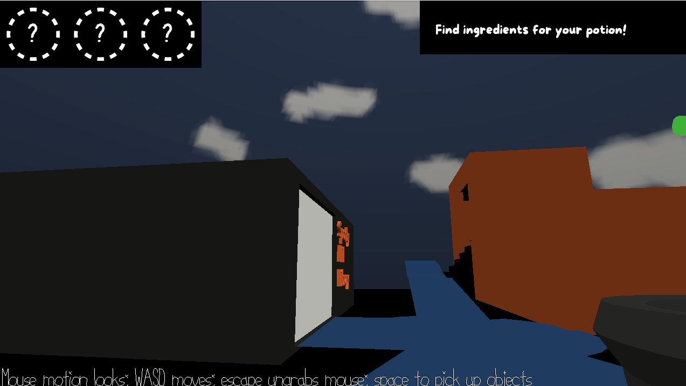

# Spooky Hill

Author: Emily Amspoker

Design: You are a ghost trying to brew your favorite potion (a pumpkin spice latte) in a spooky version of Squirrel Hill. I don't know of a game that does this.

Screen Shot:

How To Play:

WASD to walk, space to pick up materials for your potion (they should light up when you're close enough to pick them up). Right now nothing happens if you gather all the materials. 

Sources: n/a.

This game was built with [NEST](NEST.md).

